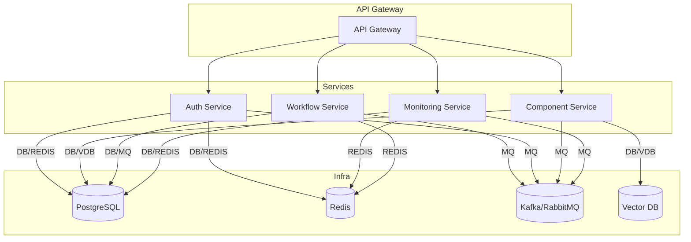

# AI Ops Console Backend Architecture

## Overview
This backend is designed as a microservices architecture to support the AI Ops Console frontend. It provides scalable, secure, and modular services for enterprise AI workflow management.

## Core Microservices

### 1. Authentication & User Management Service
- Handles user registration, login, OAuth 2.0, JWT issuance, and role-based access control (RBAC).
- Manages user profiles, permissions, and session management.

### 2. AI Component Management Service
- CRUD operations for AI components (create, update, delete, list, search).
- Stores component metadata, schemas, and versioning.
- Integrates with a vector database for similarity search.

### 3. Workflow Orchestration Service
- Manages workflow definitions, DAGs, and scheduling.
- Integrates with orchestration engines (Temporal, Prefect, or Airflow).
- Handles workflow validation and versioning.

### 4. Execution Monitoring Service
- Tracks workflow runs, statuses, logs, and metrics.
- Provides real-time updates and historical data.
- Integrates with monitoring/observability stack (Prometheus, Grafana, Jaeger).

## Inter-Service Communication
- Services communicate via RESTful APIs and asynchronous message queues (Kafka or RabbitMQ).
- API Gateway routes external requests and enforces security policies.
- Redis is used for distributed caching and session management.

## Recommended Tech Stack
- **Runtime:** Node.js (Express or Fastify), Python (FastAPI) for orchestration
- **Databases:** PostgreSQL (relational), Redis (cache/session), Pinecone/Weaviate (vector)
- **Message Queue:** Kafka or RabbitMQ
- **API Gateway:** Kong, AWS API Gateway, or NGINX
- **Containerization:** Docker, Kubernetes
- **CI/CD:** GitHub Actions, GitLab CI
- **Infrastructure as Code:** Terraform or Pulumi
- **Monitoring:** Prometheus, Grafana, Jaeger, ELK stack

## Architecture Diagram

## Next Steps
- Define API contracts for each service
- Scaffold service directories and initial codebase
- Set up local development environment 